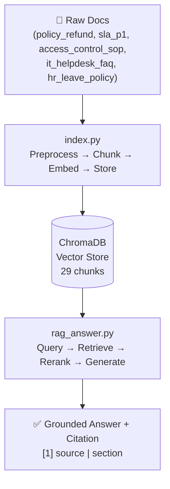
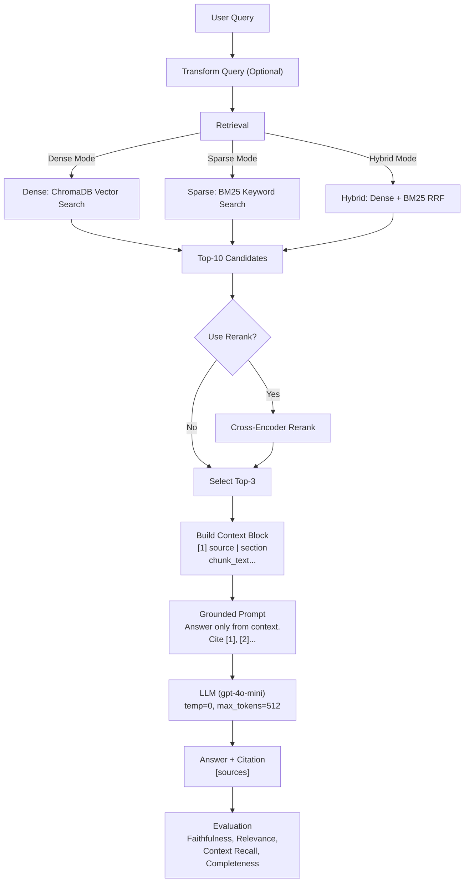

# Architecture — RAG Pipeline (Day 08 Lab)

<<<<<<< HEAD
> Template: Điền vào các mục này khi hoàn thành từng sprint.
> Deliverable của Documentation Owner

=======
>>>>>>> 67e75208944c2f9c9a12bad5107052b425b68486
## 1. Tổng quan kiến trúc



**Mô tả ngắn gọn:**
> Xây dựng **trợ lý nội bộ tự động hỏi-đáp** để giải quyết câu hỏi của nhân viên CS/IT Helpdesk về chính sách công ty, SLA ticket, quy trình cấp quyền, và FAQ. Hệ thống retrieve dữ liệu từ 5 tài liệu chính sách đã index, sau đó sử dụng LLM để sinh câu trả lời **có chứng cứ** (grounded-truth), tránh hallucination. Mục tiêu: giảm thời gian support, đảm bảo tính nhất quán của chính sách.

---

## 2. Indexing Pipeline (Sprint 1)

### Tài liệu được index
| File | Nguồn | Department | Số chunk |
|------|-------|-----------|---------|
| `policy_refund_v4.txt` | policy/refund-v4.pdf | CS | 6 |
| `sla_p1_2026.txt` | support/sla-p1-2026.pdf | IT Support | 5 |
| `access_control_sop.txt` | it/access-control-sop.md | IT Security | 9 |
| `it_helpdesk_faq.txt` | support/helpdesk-faq.md | IT Helpdesk | 5 |
| `hr_leave_policy.txt` | hr/leave-policy-2026.pdf | HR | 4 |
| **TỔNG CỘNG** | | | **29 chunks** |

### Quyết định chunking
| Tham số | Giá trị | Lý do |
|---------|---------|-------|
| Chunk size | 400 tokens (~1600 ký tự) | Cân bằng: đủ context để LLM hiểu, tuy nhiên không quá dài để tránh "lost in middle" |
| Overlap | 80 tokens (~320 ký tự) | Giữ continuity giữa chunks, tránh mất thông tin ở ranh giới |
| Chunking strategy | **Heading-based + Paragraph-based** | Split theo section heading (`===...===`) trước, sau đó split theo paragraph nếu section quá dài |
| Metadata fields | `source`, `section`, `effective_date`, `department`, `access` | Phục vụ citation (source + section), freshness check (effective_date), access control (access) |

### Embedding model
- **Model**: **OpenAI `text-embedding-3-small`** (1536 dimensions, cost-effective, multilingual)
- **Vector store**: **ChromaDB** (PersistentClient, persistent on disk)
- **Similarity metric**: **Cosine** (normalized vector similarity in [0, 1])

---

## 3. Retrieval Pipeline (Sprint 2 + 3)

### Baseline (Sprint 2)
| Tham số | Giá trị | Giải thích |
|---------|---------|-----------|
| **Strategy** | Dense (embedding similarity) | ChromaDB query với query embedding, lấy top-k candidates dựa cosine similarity |
| **Top-k search** | 10 | Số chunk lấy từ vector store trước khi select (retrieval rộng) |
| **Top-k select** | 3 | Số chunk gửi vào LLM prompt (balance: đủ context vs độ dài context) |
| **Rerank** | ✗ Không | Không dùng cross-encoder rerank; top-3 của dense đã đủ tốt |
| **Query transform** | ✗ Không | Query trực tiếp, không dùng expansion/decomposition |

### Variant (Sprint 3)
| Tham số | Giá trị | Thay đổi so với baseline |
|---------|---------|------------------------|
| **Strategy** | Hybrid RRF (Dense + Sparse) | Dense baseline → Hybrid (kết hợp dense vector + BM25 keyword) |
| **Dense weight** | 0.6 | Ưu tiên semantic understanding |
| **Sparse weight** | 0.4 | Bổ sung keyword matching (exact term, mã lỗi) |
| **RRF K** | 60 | Reciprocal Rank Fusion merging formula |
| **Top-k search** | 10 | Giữ nguyên baseline |
| **Top-k select** | 3 | Giữ nguyên baseline |
| **Rerank** | ✗ Không | Không dùng cross-encoder; RRF merging đã thay thế |
| **Query transform** | ✗ Không | Query trực tiếp (không dùng expansion/decomposition) |

**Lý do chọn Hybrid RRF:**
> Corpus có **mix ngôn ngữ tự nhiên + keyword cụ thể**: tài liệu chính sách/quy trình (policy, HR) dùng câu tự nhiên → dense embedding tốt; tuy nhiên test questions có mã lỗi cụ thể (`ERR-403-AUTH`), tên SLA chuyên ngành (`P1`, `escalation`) mà sparse BM25 có thể match tốt hơn. Hybrid RRF kết hợp cả hai, kỳ vọng cải thiện recall trên câu hỏi keyword-heavy (q09, q07).

---

## 4. Generation (Sprint 2)

### Grounded Prompt Template
```
Answer only from the retrieved context below.
If the context is insufficient to answer the question, say you do not know and do not make up information.
Cite the source field (in brackets like [1]) when possible.
Keep your answer short, clear, and factual.
Respond in the same language as the question.

Question: {query}

Context:
[1] {source} | {section} | score={score}
{chunk_text}

[2] {source} | {section} | score={score}
{chunk_text}

[3] ...

Answer:
```

**Quy tắc prompt (4 pillars từ slide Day 08):**
1. **Evidence-only**: Trả lời CHỈ dựa trên retrieved context, tránh kiến thức ngoài
2. **Abstain**: Khi context không đủ → nói "Tôi không biết" thay vì bịa chuyện (hallucinate)
3. **Citation**: Gắn [1], [2] vào answer để theo dõi nguồn (traceability)
4. **Short & Clear**: Output ngắn gọn, dễ đọc, nhất quán (temperature=0)

### LLM Configuration
| Tham số | Giá trị | Lý do |
|---------|---------|-------|
| **Model** | **`gpt-4o-mini`** | Giáp chi phí-chất lượng tốt; đủ khả năng lý luận trên context short-form |
| **Temperature** | 0 | Output xác định (deterministic), thuận lợi cho evaluation và reproducibility |
| **Max tokens** | 512 | Giới hạn độ dài answer, tránh output quá dài; phù hợp cho short-form grounded answer |

---

## 5. Failure Mode & Debug Checklist

> Dùng khi pipeline trả lời sai — kiểm tra từ trên xuống: index → retrieval → generation

| Failure Mode | Triệu chứng | Cách kiểm tra | Cách khắc phục |
|-------------|-------------|---------------|----------------|
| **Index outdated** | Retrieve về docs cũ / sai version | Chạy `inspect_metadata_coverage()` trong index.py → kiểm tra effective_date, số chunks | Re-run `build_index()` |
| **Chunking breaks structure** | Chunk cắt giữa điều khoản, mất context | Chạy `list_chunks()` trong index.py → xem text preview → check có cắt ngang không | Điều chỉnh CHUNK_SIZE hoặc overlap |
| **Retrieval misses expected source** | Expected source không có trong top-3 selected | Chạy `score_context_recall()` trong eval.py → check retrieved sources | Đổi retrieval_mode (dense → hybrid) hoặc tăng top_k_search |
| **Answer hallucinated** | Answer có info không có trong retrieved chunks | Chạy `score_faithfulness()` trong eval.py → LLM-as-judge | Strengthen prompt: thêm "Do not make up information" |
| **Answer không cite source** | Answer đúng nhưng không có [1] reference | Đọc thủ công answer | Thêm instruction: "Always cite the source in brackets like [1]" |
| **Lost in the middle** | Model bỏ qua thông tin ở chunk 2-3 | Kiểm tra độ dài context_block (số token) | Giảm top_k_select từ 3 → 2, hoặc reorder chunks |
| **Abstain failure** | Model trả lời khi không nên (hallucinate thay vì "không biết") | Compare với expected_answer → nếu expect "không biết" nhưng model trả lời → abstain fail | Strengthen abstain instruction: "If you cannot find the answer in the provided context, say 'I do not know'" |

---

## 9. End-to-End Pipeline Diagram



**Chi tiết từng bước:**
1. **Transform Query** (Optional): Nếu dùng expansion/decomposition → sinh các variant của query
2. **Retrieval** (Dense/Sparse/Hybrid): Lấy top-10 candidates từ vector store hoặc BM25
3. **Rerank** (Optional): Nếu cần, dùng cross-encoder để re-order top-10 → top-3
4. **Context Block**: Format chunks với [1], [2], ... để LLM có thể cite
5. **Grounded Prompt**: Prompt ép model trả lời từ context, cite source, abstain nếu thiếu data
6. **LLM Generation**: gpt-4o-mini với temperature=0 (ổn định) sinh answer
7. **Evaluation**: Chấm điểm 4 metrics bằng LLM-as-Judge

---