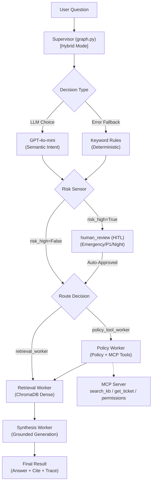

# System Architecture — Lab Day 09

**Nhóm:** Day8-Lab8-9-10  
**Ngày:** 2026-04-14  
**Version:** 1.0

---

## 1. Tổng quan kiến trúc

> Mô tả ngắn hệ thống của nhóm: chọn pattern gì, gồm những thành phần nào.

Nhóm chọn Supervisor-Worker để tách trách nhiệm rõ ràng giữa routing, retrieval, policy checking và synthesis. Sang Day 09, hệ thống được nâng cấp lên kiến trúc **Hybrid Orchestrator**: Supervisor sử dụng LLM (GPT-4o-mini) để phân tích ý định thay cho rule-based, tích hợp cơ chế **Risk-based HITL** tự động và cơ chế **Fallback** bảo vệ nếu API gặp sự cố. Toàn bộ quá trình được lưu trace chi tiết (`run_id`, `latency_ms`, `timestamp`) giúp quan sát và debug theo thời gian thực.

---

## 2. Sơ đồ Pipeline

> Vẽ sơ đồ pipeline dưới dạng text, Mermaid diagram, hoặc ASCII art.
> Yêu cầu tối thiểu: thể hiện rõ luồng từ input → supervisor → workers → output.

User Request
     │
     ▼
┌──────────────┐
│  Supervisor  │ (Hybrid: LLM + Rule Fallback)
└──────┬───────┘
       │
 [Risk Sensor] ──▶ [HITL: human_review] (Trigger if risk_high)
       │                    │
       ▼                    │
  ┌────┴────────────────────┼─▶ [Supervisor Choice] 
  │                         │       (route)
  ▼                         ▼          │
Retrieval Worker     Policy Tool Worker  │
  (evidence)           (policy check+MCP)│
  │                         │           │
  └─────────┬───────────────┴───────────┘
            │
            ▼
      Synthesis Worker
        (Grounded Answer)
            │
            ▼
         Output

**Sơ đồ thực tế của nhóm:**

---

## 3. Vai trò từng thành phần

### Supervisor (`graph.py`)

| **Architecture** | **Hybrid Orchestrator** | 
| **Nhiệm vụ** | Phân tích task (LLM), chọn worker route, gắn lý do route và risk signals |
| **Input** | `task`, `history` |
| **Output** | supervisor_route, route_reason, risk_high, needs_tool |
| **Routing logic** | Ưu tiên **LLM Classifier** (GPT-4o-mini). Tự động fallback sang **Rule-based keyword matching** nếu API có sự cố. |
| **HITL condition** | Trigger lập tức khi phát hiện rủi ro cao: Mã lỗi khẩn cấp, sự cố ngoài giờ hành chính (2am), hoặc yêu cầu cấp quyền Critical. |

### Retrieval Worker (`workers/retrieval.py`)

| Thuộc tính | Mô tả |
|-----------|-------|
| **Nhiệm vụ** | Query ChromaDB và trả `retrieved_chunks`, `retrieved_sources` theo contract |
| **Embedding model** | `all-MiniLM-L6-v2` (SentenceTransformer) |
| **Top-k** | Mặc định `3` (`RETRIEVAL_TOP_K`, override bằng state/env) |
| **Stateless?** | Yes (không giữ session state giữa các run) |

### Policy Tool Worker (`workers/policy_tool.py`)

| Thuộc tính | Mô tả |
|-----------|-------|
| **Nhiệm vụ** | Phân loại domain policy, detect exception rules, gọi MCP khi cần thêm dữ liệu |
| **MCP tools gọi** | `search_kb`, `get_ticket_info` (runtime); server còn có `check_access_permission`, `create_ticket` |
| **Exception cases xử lý** | Flash Sale, digital product/license, activated product, no emergency bypass level 3, emergency bypass level 2, temporal scoping pre-v4 |

### Synthesis Worker (`workers/synthesis.py`)

| Thuộc tính | Mô tả |
|-----------|-------|
| **LLM model** | `gpt-4o-mini` (fallback Gemini nếu có key) |
| **Temperature** | `0.1` |
| **Grounding strategy** | Strict evidence-only prompt, cite `[n]`, include source mapping cuối câu trả lời |
| **Abstain condition** | Nếu không có chunks hoặc context không đủ -> trả "Không đủ thông tin trong tài liệu nội bộ" |

### MCP Server (`mcp_server.py`)

| Tool | Input | Output |
|------|-------|--------|
| search_kb | query, top_k | chunks, sources |
| get_ticket_info | ticket_id | ticket details |
| check_access_permission | access_level, requester_role | can_grant, approvers |
| create_ticket | priority, title, description | mock ticket_id, url, created_at |

---

## 4. Shared State Schema

> Liệt kê các fields trong AgentState và ý nghĩa của từng field.

| Field | Type | Mô tả | Ai đọc/ghi |
|-------|------|-------|-----------|
| task | str | Câu hỏi đầu vào | supervisor đọc |
| supervisor_route | str | Worker được chọn | supervisor ghi |
| route_reason | str | Lý do route | supervisor ghi |
| risk_high | bool | Cờ rủi ro cao để cân nhắc HITL | supervisor ghi, graph đọc |
| needs_tool | bool | Có cần gọi MCP/tool hay không | supervisor ghi, policy_tool đọc |
| hitl_triggered | bool | Đã trigger human review chưa | human_review ghi |
| retrieved_chunks | list | Evidence từ retrieval | retrieval ghi, synthesis đọc |
| retrieved_sources | list[str] | Tập source đã retrieve | retrieval ghi, synthesis đọc |
| policy_result | dict | Kết quả kiểm tra policy | policy_tool ghi, synthesis đọc |
| mcp_tools_used | list | Tool calls đã thực hiện | policy_tool ghi |
| workers_called | list[str] | Thứ tự worker đã chạy | mọi node ghi |
| worker_io_logs | list[dict] | Input/output/error theo worker | mọi worker ghi |
| history | list[str] | Log dạng timeline cho từng step | supervisor/worker/graph ghi |
| final_answer | str | Câu trả lời cuối | synthesis ghi |
| sources | list[str] | Danh sách nguồn dùng để trả lời | synthesis ghi |
| confidence | float | Mức tin cậy | synthesis ghi |
| latency_ms | int | Tổng thời gian run (ms) | graph ghi |
| run_id | str | ID duy nhất (run_YYYYMMDD_HHMMSS) | graph khởi tạo |
| timestamp | str | Thời điểm thực thi (ISO) | graph khởi tạo |

---

## 5. Lý do chọn Supervisor-Worker so với Single Agent (Day 08)

| Tiêu chí | Single Agent (Day 08) | Supervisor-Worker (Day 09) |
|----------|----------------------|--------------------------|
| Debug khi sai | Khó — không rõ lỗi ở đâu | Dễ hơn — test từng worker độc lập |
| Thêm capability mới | Phải sửa toàn prompt | Thêm worker/MCP tool riêng |
| Routing visibility | Không có | Có route_reason trong trace |
| Traceability | Chủ yếu log answer cuối | Có full trace: route, workers_called, worker_io_logs, mcp_tools_used |
| Multi-hop policy + SLA | Dễ lẫn logic trong 1 prompt | Tách policy + retrieval + synthesis, dễ kiểm soát hơn |
| Fault isolation | Lỗi LLM/retrieval trộn lẫn | Có thể cô lập từng worker để debug |

**Nhóm điền thêm quan sát từ thực tế lab:**

Từ run 15 câu test, supervisor route đúng toàn bộ tập câu theo expected route. Các case khó như `q13`, `q15` đi đúng nhánh `policy_tool_worker` và gọi đủ chain workers trước khi synthesis. Khi MCP HTTP fail, trace vẫn giữ được error detail để nhóm khoanh vùng nguyên nhân hạ tầng thay vì nhầm sang lỗi routing.

---

## 6. Giới hạn và điểm cần cải tiến

> Nhóm mô tả những điểm hạn chế của kiến trúc hiện tại.

1. Routing hiện là keyword rule-based nên có thể brittle khi câu hỏi diễn đạt mới hoặc nhiễu ngôn ngữ.
2. MCP integration chưa có fallback strategy chuẩn khi HTTP transport lỗi (một số trace ghi `HTTP_TRANSPORT_FAILED`).
3. Confidence hiện là heuristic từ retrieval score + markers, chưa calibrate bằng ground-truth accuracy.
