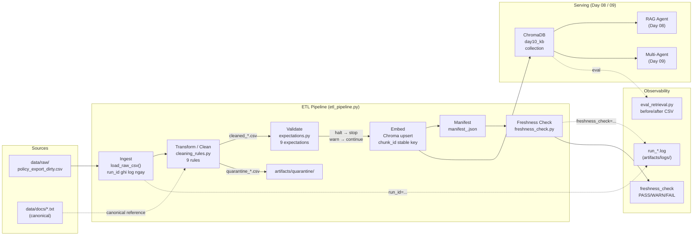

# Kiến trúc Pipeline — Lab Day 10: Data Pipeline & Observability

**Nhóm:** Lab Day 10 Group  
**Cập nhật:** 2026-04-15  
**Run ID tham chiếu:** `2026-04-15T08-50Z`

---

## 1. Sơ đồ luồng



**Điểm đo freshness:** `latest_exported_at` trong manifest (boundary = publish, không phải `cron_start`).  
**run_id:** ghi vào log ngay dòng đầu khi `cmd_run` khởi động — trace xuyên suốt từ log → manifest → Chroma metadata.  
**Quarantine:** mọi record bị loại đều vào `artifacts/quarantine/quarantine_<run_id>.csv` — không silent drop.

---

## 2. Ranh giới trách nhiệm

| Thành phần | Input | Output | Module | Owner |
|------------|-------|--------|--------|-------|
| **Ingest** | `data/raw/policy_export_dirty.csv` | `List[Dict]` rows | `transform/cleaning_rules.py :: load_raw_csv()` | Ingestion Owner |
| **Transform / Clean** | Raw rows (10 dòng) | `cleaned[]` + `quarantine[]` | `transform/cleaning_rules.py :: clean_rows()` | Cleaning Owner |
| **Quality Gate** | `cleaned[]` rows | `List[ExpectationResult]`, halt flag | `quality/expectations.py :: run_expectations()` | Cleaning Owner |
| **Embed** | `cleaned_*.csv` | ChromaDB upsert, prune stale | `etl_pipeline.py :: cmd_embed_internal()` | Embed Owner |
| **Manifest** | Metrics từ run | `manifest_<run_id>.json` | `etl_pipeline.py :: cmd_run()` | Embed Owner |
| **Freshness Check** | `manifest_*.json` | `PASS / WARN / FAIL` | `monitoring/freshness_check.py` | Monitoring Owner |
| **Eval Retrieval** | ChromaDB, test questions | `artifacts/eval/*.csv` | `eval_retrieval.py` | Monitoring Owner |

---

## 3. Idempotency & Rerun

**Chiến lược:** Upsert theo `chunk_id` ổn định (stable key).

```
chunk_id = "{doc_id}_{seq}_{sha256(doc_id|chunk_text|seq)[:16]}"
```

| Tính chất | Cơ chế |
|-----------|--------|
| **Idempotent upsert** | Cùng `doc_id + chunk_text + seq` → cùng `chunk_id` → Chroma `upsert` ghi đè metadata, không tạo duplicate |
| **Prune stale vectors** | Sau mỗi run, `prev_ids = col.get(include=[])` → xóa ID không còn trong `cleaned` → index luôn phản chiếu snapshot hiện tại |
| **Rerun 2 lần** | Kết quả giống nhau: `embed_prune_removed=0`, `embed_upsert count=6` — không phình collection |
| **Phân biệt vs UUID** | `uuid4()` mỗi rerun tạo ID mới → duplicate vector → retrieval bị nhiễu chunk trùng nội dung |

**Baseline run kết quả:**
```
run_id=2026-04-15T08-50Z
raw_records=10  →  cleaned_records=6  →  quarantine_records=4
embed_upsert count=6  collection=day10_kb
```

---

## 4. Liên hệ Day 09

```
Day 09 (Multi-agent)
  └── retrieval_worker
        └── ChromaDB collection: day10_kb
              ↑
        Day 10 pipeline publish ở đây
```

- Day 09 agent kéo từ **cùng ChromaDB collection** (`day10_kb`) mà Day 10 pipeline publish.
- Khi pipeline Day 10 chạy với `--no-refund-fix` (inject corruption), collection chứa chunk "14 ngày" → agent Day 09 trả lời **sai**.
- Sau khi pipeline chuẩn chạy lại (prune + upsert), chunk stale bị xóa → agent Day 09 trả lời **đúng**.
- Bằng chứng: `artifacts/eval/eval_injected.csv` (hits_forbidden=yes) vs `artifacts/eval/eval_clean.csv` (hits_forbidden=no).

**Lưu ý tách biệt:** Day 10 pipeline không dùng corpus `data/docs/*.txt` trực tiếp để embed — nó xử lý export CSV (`policy_export_dirty.csv`) đại diện cho snapshot từ DB/API. Các file `.txt` là canonical reference để verify nội dung.

---

## 5. Cleaning Rules & Expectations (9+9)

### Rules (transform/cleaning_rules.py)

| # | Rule | Hành động | Env var |
|---|------|-----------|---------|
| 1 | `doc_id` không trong allowlist | Quarantine: `unknown_doc_id` | — |
| 2 | `effective_date` không parse được | Quarantine: `missing/invalid_effective_date` | — |
| 3 | `hr_leave_policy` với date < cutoff | Quarantine: `stale_hr_policy_effective_date` | `HR_LEAVE_MIN_EFFECTIVE_DATE` (default 2026-01-01) |
| 4 | `chunk_text` rỗng | Quarantine: `missing_chunk_text` | — |
| 5 | Trùng nội dung `chunk_text` | Quarantine: `duplicate_chunk_text` (giữ bản đầu) | — |
| 6 | `policy_refund_v4` chứa "14 ngày làm việc" | Fix → "7 ngày làm việc" + marker | `--no-refund-fix` flag |
| 7 | BOM / zero-width space / soft-hyphen | Quarantine: `bom_or_invisible_char_in_text` | — |
| 8 | `effective_date` vượt FUTURE_DATE_CUTOFF | Quarantine: `effective_date_beyond_future_cutoff` | `FUTURE_DATE_CUTOFF` (default 2030-01-01) |
| 9 | Whitespace thừa (tab/newline/multi-space) | Fix → normalize + marker | — |

### Expectations (quality/expectations.py)

| # | ID | Severity | Kiểm tra |
|---|----|----------|---------|
| E1 | `min_one_row` | **halt** | ≥ 1 dòng sau clean |
| E2 | `no_empty_doc_id` | **halt** | Không `doc_id` rỗng |
| E3 | `refund_no_stale_14d_window` | **halt** | Không "14 ngày làm việc" trong refund chunks |
| E4 | `chunk_min_length_8` | warn | `chunk_text` ≥ 8 ký tự |
| E5 | `effective_date_iso_yyyy_mm_dd` | **halt** | Đúng regex `^\d{4}-\d{2}-\d{2}$` |
| E6 | `hr_leave_no_stale_10d_annual` | **halt** | Không "10 ngày phép năm" trong HR chunks |
| E7 | `no_bom_or_invisible_char_in_cleaned` | **halt** | Cross-check Rule 7 — lưới an toàn thứ 2 |
| E8 | `no_future_effective_date_beyond_cutoff` | warn | Không date > FUTURE_DATE_CUTOFF trong cleaned |
| E9 | `chunk_text_min_word_count` | warn | Mỗi chunk ≥ 5 từ (override `CHUNK_MIN_WORD_COUNT`) |

---

## 6. Rủi ro đã biết

| Rủi ro | Mức độ | Biện pháp hiện tại | Tồn đọng |
|--------|--------|-------------------|----------|
| Freshness FAIL vì CSV mẫu cũ (exported_at = 2026-04-10) | Thấp (có chủ đích) | Documented trong runbook; đặt `FRESHNESS_SLA_HOURS=200` trong `.env` để PASS với data mẫu | Cần export thật với timestamp mới khi prod |
| ChromaDB không có auth/persistence xuyên session | Trung bình | PersistentClient ghi disk (`./chroma_db`); prune stale sau mỗi run | Chưa có backup/restore script |
| Parser CSV lỏng (DictReader không báo lỗi khi thiếu cột) | Trung bình | E2 (no_empty_doc_id halt) và E5 (ISO date halt) bắt hầu hết | Chưa validate header schema đầu pipeline |
| Encoding UTF-8 chỉ check ở Rule 7 (BOM) | Thấp-Trung | Rule 7 + E7 (halt) đảm bảo không chunk lạ lọt vào index | Chưa check toàn bộ codepoint hợp lệ |
| Rule 9 (whitespace normalize) thay đổi `chunk_text` sau stable `chunk_id` tính | Đã xử lý | `chunk_id` tính trên `fixed_text` (sau normalize) — không đổi khi rerun cùng data | — |
