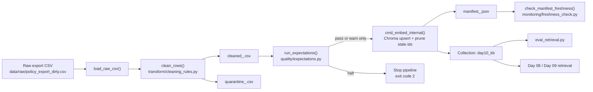

# Pipeline Architecture — Lab Day 10

**Phạm vi:** pipeline dữ liệu cho KB của Day 08 / Day 09  
**Entrypoint:** `etl_pipeline.py`  
**Artifact tham chiếu:** `artifacts/manifests/manifest_2026-04-15T08-50Z.json`

## 1. Mục tiêu pipeline

Pipeline này xử lý **raw CSV export** trước khi publish lại vào ChromaDB. Mục tiêu không chỉ là "clean cho đẹp", mà là tạo một **publish boundary rõ ràng** để agent Day 08 / Day 09 chỉ đọc snapshot đã qua:

1. ingest
2. clean
3. validate
4. embed
5. manifest + freshness check

Với sample run hiện có, manifest cho thấy:

| Metric | Giá trị |
|-------|--------|
| `raw_records` | 10 |
| `cleaned_records` | 6 |
| `quarantine_records` | 4 |
| `latest_exported_at` | `2026-04-10T08:00:00` |
| `freshness` | FAIL với SLA 24h |

## 2. Luồng xử lý end-to-end



## 3. Thành phần chính

| Bước | Hàm / module | Input | Output | Vai trò |
|------|---------------|-------|--------|--------|
| Ingest | `load_raw_csv()` | raw CSV | `List[Dict]` | Đọc snapshot từ nguồn |
| Clean | `clean_rows()` | raw rows | `cleaned`, `quarantine` | Chuẩn hoá, quarantine, fix content |
| Persist CSV | `write_cleaned_csv()`, `write_quarantine_csv()` | cleaned/quarantine rows | artifact CSV | Tạo evidence before/after |
| Validate | `run_expectations()` | cleaned rows | `results`, `halt` | Chặn publish nếu lỗi nghiêm trọng |
| Embed | `cmd_embed_internal()` | cleaned CSV | Chroma collection | Publish snapshot sang vector store |
| Manifest | `cmd_run()` | metrics của run | JSON manifest | Ghi lineage + counters |
| Freshness | `check_manifest_freshness()` | manifest | `PASS/WARN/FAIL` | Quan sát độ tươi dữ liệu |

## 4. Cleaning, validation, publish boundary

### Cleaning

`transform/cleaning_rules.py` hiện có 9 rule:

| Nhóm | Rule | Kết quả |
|------|------|---------|
| Allowlist | `doc_id` phải thuộc tập hợp hợp lệ | Quarantine `unknown_doc_id` |
| Date normalization | `effective_date` phải parse được | Quarantine nếu thiếu/sai format |
| Version gate | `hr_leave_policy` cũ hơn `HR_LEAVE_MIN_EFFECTIVE_DATE` | Quarantine bản HR stale |
| Null check | `chunk_text` rỗng | Quarantine |
| Dedup | trùng `chunk_text` sau normalize | Giữ bản đầu, quarantine bản sau |
| Content fix | refund window `14 ngày làm việc` -> `7 ngày làm việc` | Sửa text + marker |
| Encoding guard | BOM / invisible chars | Quarantine |
| Future cutoff | `effective_date` > `FUTURE_DATE_CUTOFF` | Quarantine |
| Whitespace normalization | tab/newline/multi-space -> một space | Sửa text + marker |

Sample raw file tạo ra 4 dòng quarantine với các lý do nhìn thấy rõ trong artifact:

1. `duplicate_chunk_text`
2. `missing_effective_date`
3. `stale_hr_policy_effective_date`
4. `unknown_doc_id`

### Validation

`quality/expectations.py` chạy sau clean. Kết quả chia 2 mức:

| Severity | Hành vi |
|----------|---------|
| `halt` | dừng pipeline, trả exit code `2` |
| `warn` | vẫn tiếp tục embed |

Các expectation `halt` quan trọng nhất:

1. `min_one_row`
2. `no_empty_doc_id`
3. `refund_no_stale_14d_window`
4. `effective_date_iso_yyyy_mm_dd`
5. `hr_leave_no_stale_10d_annual`
6. `no_bom_or_invisible_char_in_cleaned`

### Publish boundary

Pipeline chỉ publish vào Chroma sau khi:

1. cleaned CSV đã được ghi ra disk
2. expectation không `halt`
3. embed hoàn tất
4. manifest đã được ghi

Điều này tạo boundary rõ ràng giữa:

- dữ liệu nguồn còn lỗi
- dữ liệu đã đủ điều kiện để agent truy xuất

## 5. Idempotency và snapshot semantics

Phần publish dùng 2 cơ chế quan trọng:

### Stable `chunk_id`

`chunk_id` được tạo bởi `_stable_chunk_id(doc_id, chunk_text, seq)` nên cùng một cleaned snapshot sẽ cho cùng ID. Điều này cho phép `upsert` thay vì tạo bản ghi vector mới mỗi lần rerun.

### Prune stale ids

Trước khi upsert, pipeline đọc toàn bộ `ids` hiện có trong collection và xóa những id không còn nằm trong cleaned run hiện tại.

Ý nghĩa:

1. collection phản ánh đúng **snapshot publish hiện tại**
2. rerun không làm phình collection
3. chunk stale từ run inject có thể bị dọn khỏi top-k retrieval

Đây là điểm nối trực tiếp với Sprint 3: nếu chạy `--no-refund-fix --skip-validate`, chunk refund sai có thể lọt vào index; sau đó một run chuẩn sẽ prune snapshot cũ và upsert snapshot sạch.

## 6. Observability artifacts

Sau một lần `python etl_pipeline.py run`, pipeline tạo các artifact sau:

| Loại | Đường dẫn | Mục đích |
|------|-----------|----------|
| Cleaned CSV | `artifacts/cleaned/cleaned_<run-id>.csv` | Snapshot sau clean |
| Quarantine CSV | `artifacts/quarantine/quarantine_<run-id>.csv` | Evidence cho record bị loại |
| Manifest | `artifacts/manifests/manifest_<run-id>.json` | Metrics, lineage, config flags |
| Log | `artifacts/logs/run_<run-id>.log` | Dòng sự kiện của pipeline |
| Eval CSV | `artifacts/eval/*.csv` | Bằng chứng retrieval before/after |

Các field quan trọng nhất trong manifest:

| Field | Ý nghĩa |
|-------|--------|
| `run_id` | ID trace xuyên suốt pipeline |
| `raw_path` | nguồn input |
| `raw_records` / `cleaned_records` / `quarantine_records` | volume metrics |
| `latest_exported_at` | timestamp để tính freshness |
| `no_refund_fix` | run có inject refund bug hay không |
| `skipped_validate` | có bypass halt gate hay không |
| `cleaned_csv` | artifact cleaned tương ứng |
| `chroma_collection` | collection publish |

## 7. Freshness boundary

Freshness không đo từ lúc cron chạy, mà đo từ `latest_exported_at` trong manifest. Trong code:

1. `cmd_run()` lấy `max(exported_at)` từ cleaned rows
2. ghi vào manifest dưới key `latest_exported_at`
3. `check_manifest_freshness()` so sánh timestamp đó với `now`

Nếu `latest_exported_at` trống, code fallback sang `run_timestamp`. Vì vậy:

- `PASS`: tuổi dữ liệu `<= sla_hours`
- `FAIL`: tuổi dữ liệu `> sla_hours`
- `WARN`: chỉ xảy ra khi cả `latest_exported_at` lẫn `run_timestamp` đều thiếu hoặc parse lỗi

Với sample artifact hiện có, `latest_exported_at` là `2026-04-10T08:00:00`, nên freshness FAIL với SLA mặc định 24 giờ là kết quả đúng.

## 8. Liên hệ với Day 08 / Day 09

Day 10 không thay logic agent; Day 10 thay **chất lượng dữ liệu mà agent đọc**.

Luồng tích hợp là:

1. Day 10 publish cleaned snapshot vào Chroma collection `day10_kb`
2. `eval_retrieval.py` kiểm tra top-k retrieval trên collection đó
3. Agent Day 08 / Day 09 có thể dùng cùng collection để trả lời

Nếu pipeline publish snapshot xấu, agent có thể vẫn "nói nghe hợp lý" nhưng retrieval context sẽ chứa chunk stale. Sprint 3 minh hoạ điều này bằng `hits_forbidden=yes` ở `q_refund_window`.

## 9. Một lệnh chạy toàn pipeline

Lệnh chuẩn cho repo này là:

```bash
python etl_pipeline.py run
```

Sau đó có thể kiểm tra freshness và retrieval:

```bash
python etl_pipeline.py freshness --manifest artifacts/manifests/manifest_<run-id>.json
python eval_retrieval.py --out artifacts/eval/eval_clean.csv
```
